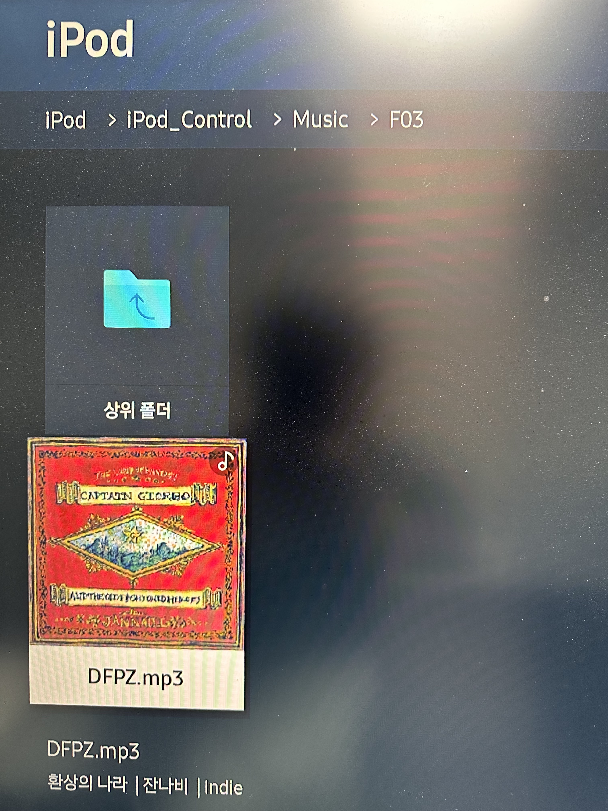

# iPodPlayer for Samsung Smart TV(monitor)

삼성 스마트 티비(모니터)에 아이팟 클래식을 연결해 노래를 듣고 싶다.

## 개요
삼성 스마트 티비는 아이팟 클래식을 연결하면 외장 저장장치로 인식하고, 파일 탐색기를 제공한다. 탐색기는 기본적으로 노래를 재생할 수 있는 기능을 제공하지만, 아이팟 클래식과의 궁합은 좋지 못하다.

### 아이팟 클래식의 음악 저장

아이팟 클래식을 파일 탐색기로 열어보면 다음과 같은 구조를 갖는다.
```bash
iPod/
    iPod_Control/
        Music/
            F00/
                FXBX.mp3
                ....mp3
            F01/
                XCFE.mp3
            ...
```
iPod/Music/Fxx/xxxx.mp3 형태로 mp3 파일이 저장되는데, 아이튠즈에서 각 mp3 파일을 식별하는 해쉬를 구성하고 해쉬의 공통부분에 맞춰 디렉토리를 구성한 것 같다. 

### 이런 상황에서 음악 재생이란

파일 탐색기에서 모든 음악을 한번에 보여주는 기능이 없어 특정 Fxx 디렉토리에 들어가, 해당 디렉토리에 있는 음악만 들을 수 있다. 음악을 듣기 위해서 매번 디렉토리를 왔다갔다 하는 번거로움이 있어, 사실상 듣기 어려운 환경이다.

## 목표
노래만  잘  나오면  된다.

### 본질적인 기능
* iPod 내의 전체 음악을 한번에 볼 수 있고, 선택을 통해 재생이 가능하다.
* 전체 음악에 대한 전체 반복, 랜덤 재생을 제공한다.

### 추가 편의 기능
* 전체 음악 리스트에 대한 테이블 제공 (페이징 적용)
* TV 앱에 맞는 UX 편의성 제공
* 단순 음원 제목이 아닌, 다른 메타데이터도 재생 화면에 보여주기
* 가사 화면 제공
* iPod classic 같은 드자인?..
* TBD
